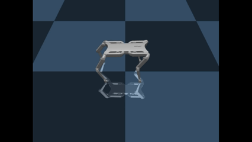

# Quadruped Walking With Reinforcement Learning
This repository contains code to train an RL agent for different tasks.
The abstract [QuadrupedEnv](./quadruped_env.py) class can be extended to create custom environments for different tasks.
Every implemented task includes a environment class, a training script, and a rendering script.

## Implemented Tasks
### Walking
- [Environment](./walker_quadruped_env.py)
- [Training Script](./train_walk.py)
- [Rendering Script](./render_walk.py)

### Recurrent Walking
Walking trained with a recurrent policy (PPO-LSTM).
- [Environment](./recurrent_walker_quadruped_env.py)
- [Training Script](./train_recurrent_walk.py)
- [Rendering Script](./render_recurrent_walk.py)

### Jumping
- [Environment](./jumper_quadruped_env.py)
- [Training Script](./train_jump.py)
- [Rendering Script](./render_jump.py)

### ZMP Walking
Walking with awareness of the Zero Moment Point (ZMP).
- [Environment](./zmp_walker_quadruped_env.py)
- [Training Script](./train_zmp_walk.py)
- [Rendering Script](./render_zmp_walk.py)
